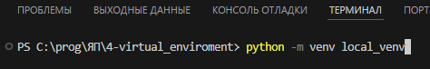
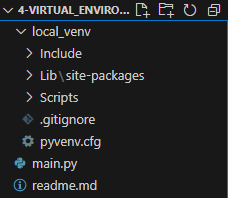
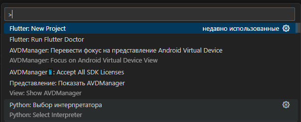
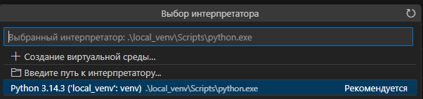
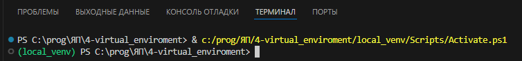
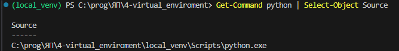
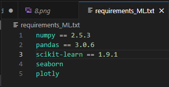
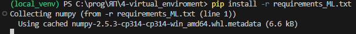

# Создание виртуального окружения

## Обращаемся к python, модулю venv и называем local_venv. Программа скопирует python в папку проекта.

## Активируем python.
Для VS Code нажимаем ctrl+shift+p и выбираем интерпретатор python.

Команда для windows:
* .\local_venv\Scripts\activate.bat - для запуска с CMD!
* .\local_venv\Scripts\Activate.ps1 - для запуска с PowerShell, терминад VS Code

 - для того, чтобы узнать от куда запускается python в PowerShell

# Установка зависимостей

Создаём requirements.txt с перечислением в столбик необходимых библиотек
\
Запускаем установку пакетов командой:\
**pip install -r requirements.txt**

*pip show имя_библиотеки* - информация о библиотеке: версия, описание, автор, лицензия и тп